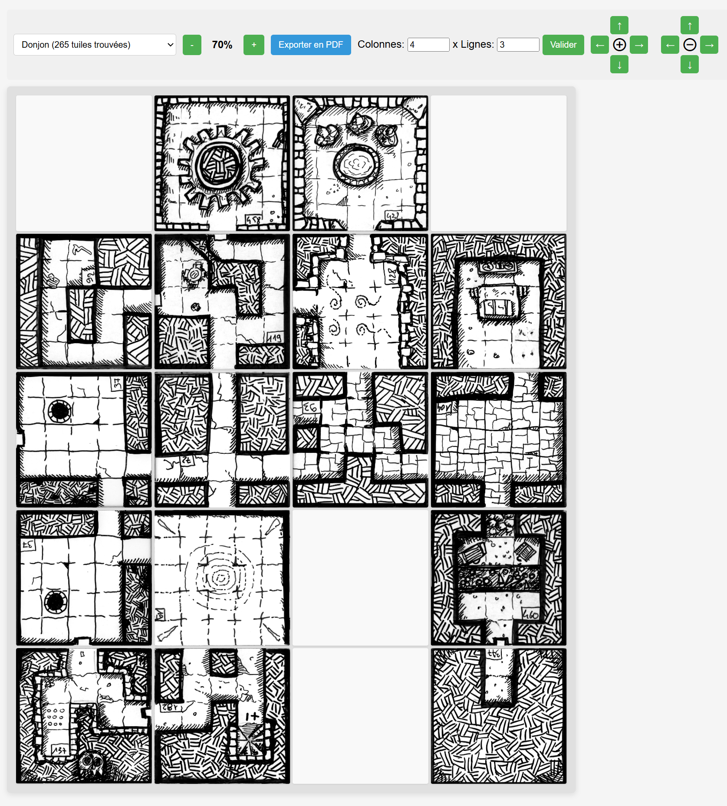

# Draw My Dungeon - Générateur de donjons

Cette application web permet de créer des grilles de donjons à partir de tuiles image en sélectionnant des packs de tuiles, en les plaçant sur une grille et en les faisant pivoter facilement.

Le projet est basé sur une interface HTML/CSS/JavaScript simple, sans framework, et fonctionne directement dans un navigateur.



## Fonctionnalités

- Sélection d’un dossier de tuiles depuis une liste déroulante
- Placement de tuiles aléatoires dans une grille
- Rotation des tuiles par clic
- Suppression d’une tuile par clic droit
- Redimensionnement de la grille
- Zoom avant/arrière
- Export de la grille en PDF

## Structure du projet

- [index.html](index.html) : page principale de l’application, contient la grille, les contrôles et les scripts chargés
- [style.css](style.css) : styles de l’interface
- [script.js](script.js) : logique principale de la grille, du placement des tuiles, de la rotation, du zoom et de l’export PDF
- [tile_configuration.js](tile_configuration.js) : configuration des dossiers de tuiles disponibles et des fichiers associés
- [tile](tile) : répertoire contenant les images des tuiles classées par dossier thématique

## Comment ça marche

1. L’application charge la configuration depuis [tile_configuration.js](tile_configuration.js).
2. Elle affiche les dossiers de tuiles disponibles dans la liste déroulante.
3. Quand vous sélectionnez un dossier, le moteur choisit aléatoirement une tuile parmi celles du dossier.
4. Un clic sur une cellule place une tuile.
5. Un autre clic sur la même tuile la fait tourner de 90°.
6. Un clic droit supprime la tuile.
7. Un cliquer-glisser permet de déplacer une tuile ou d'échanger sa position avec une autre tuile.
8. Le bouton d’export génère un PDF de la grille actuelle.

## Structure attendue du répertoire tile

Le dossier [tile](tile) doit contenir des sous-dossiers, chacun correspondant à une famille de tuiles. Chaque sous-dossier contient des fichiers PNG.

Exemple de structure :

```text
tile/
  abyss/
    tile_287.png
    tile_288.png
    tile_289.png

  cave/
    tile_151.png
    tile_152.png
    tile_153.png

  donjon/
    tile_1.png
    tile_10.png
    Tile 451.png

  room/
    tile_156.png

  sewer/
    tile_S1.png
    tile_S2.png

  stair/
    tile_S10.png
```

## Règles importantes pour ajouter des tuiles
- Chaque sous-dossier de tile représente un “pack” de tuiles.
- Les fichiers doivent être au format PNG.
- Les noms de fichiers doivent correspondre exactement à ceux déclarés dans [tile_configuration.js](tile_configuration.js).
- Le nom du sous-dossier est utilisé comme catégorie dans l’interface.
- Les images peuvent avoir des noms suivant le format "tile_*.png", par exemple : tile_451.png.

## Exemple de configuration
Dans tile_configuration.js, chaque clé représente un dossier de tuiles et chaque valeur est la liste des fichiers disponibles.

Exemple :
```text
const TILE_CONFIGURATION = {
  abyss: ["tile_287.png", "tile_288.png", "tile_289.png"],
  cave: ["tile_151.png", "tile_152.png"],
  donjon: ["tile_1.png", "Tile 451.png"],
  custom: ["my_tile.png"]
};
```

Si vous ajoutez un nouveau dossier comme custom/, il apparaîtra automatiquement dans la liste de sélection si vous l’ajoutez dans la configuration.

Vous pouvez générer automatiquement ce fichier sous windows en exécutant le script [genere_structure_js.bat](genere_structure_js.bat)

## Conseils pour les images
Pour un rendu cohérent :
- Utiliser des images de taille similaire
- Préférer des fonds transparents
- Vérifier que les images sont bien au format PNG
- Garder un style visuel cohérent au sein d’un même dossier

## Utilisation
- Ouvrir index.html dans un navigateur, ou utiliser un serveur local comme Live Server
- Sélectionner un dossier de tuiles
- Cliquer sur la grille pour placer des tuiles
- Cliquer à nouveau pour les faire pivoter
- Faire un clic droit pour les retirer
- Effectuer un cliquer-glisser pour déplacer une tuile ou échanger sa position avec une autre tuile.
- Utiliser les boutons de zoom et la grille pour ajuster la composition
- Exporter en PDF avec le bouton dédié

## Notes techniques
- Le script charge les tuiles depuis le chemin tile/<dossier>/<fichier>
- L’application utilise aussi la rotation CSS de chaque image
- Les données de la grille sont reconstruite dynamiquement à partir des images placées

## Licence
Ce projet est fourni à titre pédagogique et peut être adapté librement selon vos besoins.
