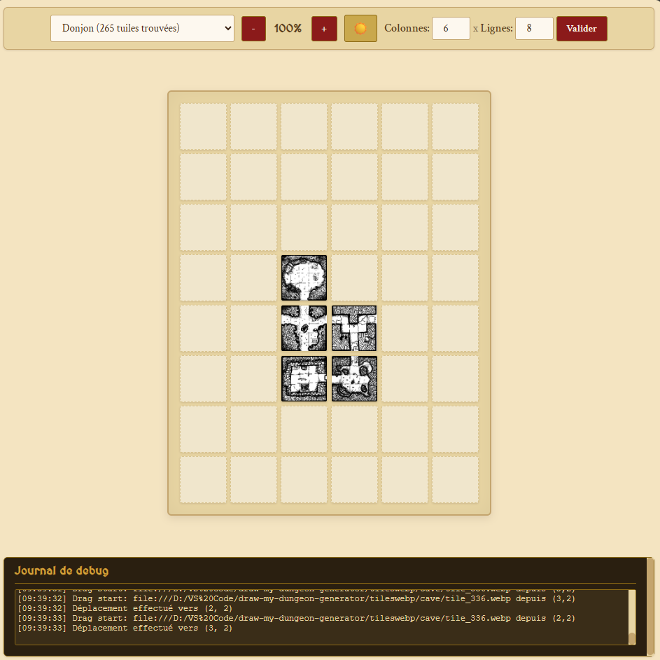

# Draw My Dungeon - Générateur de donjons

Cette application web permet de créer des grilles de donjons à partir de tuiles image en sélectionnant des packs de tuiles, en les plaçant sur une grille et en les manipulant facilement.

Le projet est basé sur une interface HTML/CSS/JavaScript pure, sans framework, et fonctionne directement dans un navigateur.



## Fonctionnalités

### Grille et tuiles
- Sélection d'un dossier de tuiles depuis une liste déroulante (ajustée automatiquement au contenu)
- Placement de tuiles aléatoires dans une grille
- Rotation des tuiles par clic (90° par clic) ou double-clic
- Suppression d'une tuile par clic droit
- Déplacement de tuiles par glisser-déposer (swap ou écrasement avec modal de confirmation)
- Redimensionnement de la grille (ajout/suppression de lignes et colonnes via boutons overlay)
- Grille centrée avec scroll automatique quand elle dépasse l'espace disponible

### Toolbar de modification (COLA)
- Panneau latéral "Tuile & Outils" avec aperçu de la tuile active
- Boutons de rotation (↻), miroir horizontal (⇔), miroir vertical (⇕) et réinitialisation (↺)
- Applique les transformations en temps réel sur la tuile sélectionnée

### Panneau FLAVOR (COLB)
- Panneau latéral "Environnement & Description" affichant les informations détaillées d'une tuile
- Mise à jour au clic sur une tuile (plus au survol)
- Affiche : chemin, rotation, miroir H/V, titre, description OSR immersive, tags, caractéristiques
- Scroll reset automatique lors du changement de tuile
- Notes de l'auteur (csvDescription) en pleine largeur

### Interface et thème
- Layout 3 colonnes : COLA (tuile/outils) | Grille | COLB (environnement/description)
- Panneaux lateraux repliables avec labels verticaux quand fermés
- Thème clair (parchemin) et sombre (donjon)
- Barre d'outils optimisée pour les écrans à 960px (tout tient sur une ligne)
- Debug panel repliable (fermé par défaut)

### Export et import
- Export PDF avec choix : grille seule ou grille + descriptions des salles
- Export PDF parallélisé (Promise.all) pour des performances optimales
- Import/Export de la grille au format JSON
- Sauvegarde automatique dans le navigateur (localStorage, debouncée)
- Compatible **file://** (ouverture directe) et serveur web

### Fiabilité
- Gestion d'erreur sur le chargement des images (onerror restaure la cellule vide)
- Modals avec cleanup des handlers onclick (pas de fuite mémoire)
- Guard typeof sur TILES_DESCRIPTIONS et TILES_FLAVOR_DATA
- Protection contre l'accumulation des listeners lors des imports successifs

## Structure du projet

- [index.html](index.html) : page principale (layout 3 colonnes, modals, toolbar)
- [style.css](style.css) : styles de l'interface (thème RPG Fantasy, responsive, collapsible panels)
- [script.js](script.js) : logique principale (grille, placement, rotation, zoom, export PDF, flavor, toolbar)
- [tile_configuration.js](tile_configuration.js) : configuration des dossiers de tuiles disponibles
- [tiles_index.js](tiles_index.js) : descriptions courtes des tuiles (dictionnaire `TILES_DESCRIPTIONS`)
- [tiles_flavor.js](tiles_flavor.js) : descriptions OSR détaillées des tuiles (variable `TILES_FLAVOR_DATA`, doublement imbriquée)
- [tileswebp/](tileswebp/) : images des tuiles au format WebP, classées par dossier (480 tuiles)
- [tilesflavor/](tilesflavor/) : fichiers JSON individuels par tuile (source des données de `tiles_flavor.js`)
- [ERRORS.md](ERRORS.md) : audit du code et backlog des bugs avec statuts (fixed/pending)
- [genstuffs/](genstuffs/) : scripts et prompts pour la génération automatique des descriptions OSR via IA
- [archives-descriptions/](archives-descriptions/) : archives des différentes versions des descriptions

## Comment ça marche

1. L'application charge la configuration depuis `tile_configuration.js`.
2. Elle affiche les dossiers de tuiles disponibles dans la liste déroulante.
3. Quand vous sélectionnez un dossier, le moteur choisit aléatoirement une tuile parmi celles du dossier.
4. Un clic sur une cellule place une tuile.
5. Un clic sur une tuile placée la sélectionne et affiche ses informations dans les panneaux COLA/COLB.
6. Un double-clic sur une tuile la fait tourner de 90°.
7. Un clic droit supprime la tuile.
8. Un cliquer-glisser permet de déplacer une tuile ou d'échanger sa position avec une autre (modal de confirmation si la case cible est occupée).
9. La toolbar dans COLA permet de modifier la rotation et les miroirs de la tuile active.
10. Le panneau COLB affiche les informations détaillées (flavor) de la tuile sélectionnée.
11. Le bouton d'export PDF propose de n'exporter que la grille ou la grille avec les descriptions des salles.

## Structure attendue du répertoire tileswebp

Le dossier `tileswebp/` doit contenir des sous-dossiers, chacun correspondant à une famille de tuiles. Chaque sous-dossier contient des fichiers WebP.

```text
tileswebp/
  abyss/
    tile_287.webp
    tile_288.webp
  cave/
    tile_151.webp
    tile_152.webp
  donjon/
    tile_1.webp
    tile_6.webp
  room/
    tile_156.webp
  sewer/
    tile_241.webp
  stair/
    tile_181.webp
```

## Règles pour ajouter des tuiles

- Chaque sous-dossier de `tileswebp/` représente un "pack" de tuiles.
- Les fichiers doivent être au format WebP.
- Les noms de fichiers doivent correspondre à ceux déclarés dans `tile_configuration.js`.
- Le nom du sous-dossier est utilisé comme catégorie dans l'interface.

## Génération automatique de tile_configuration.js

Sous Windows, exécutez `genere_structure_js.bat` pour régénérer automatiquement le fichier de configuration à partir du contenu du dossier `tileswebp/`.

## Export PDF

L'export PDF fonctionne en **file://** (ouverture directe) comme sur serveur web. Le rendu est effectué manuellement via Canvas (sans dépendance CORS).

Lors du clic sur le bouton PDF (icône document), un modal propose :
- **Grille seule** : exporte uniquement la page 1 avec la grille
- **Grille + descriptions** : exporte la grille puis ajoute des pages avec les descriptions de chaque tuile (position, thumbnail, titre, description OSR complète) organisées en 2 colonnes

Le chargement des images est parallélisé via `Promise.all` pour des performances optimales. En cas d'erreur de chargement d'une image, la cellule est restaurée à l'état vide.

## Scripting : génération des descriptions OSR

Le dossier [genstuffs/](genstuffs/) contient les outils pour générer automatiquement les descriptions de donjon au style Old School Revival (OSR) à partir des images de tuiles.

### Principe

La génération se fait en **3 phases** via le script `description_tuile.py` :

1. **Analyse visuelle** (`phase1_vision`) : le modèle `qwen2.5vl:7b` (via Ollama) analyse l'image de la tuile et extrait les caractéristiques (`sourceFeatures` : taille, forme, éclairage, décorations, dangers, etc.)
2. **Génération narrative** (`phase2_writer`) : un prompt détaillé transforme les caractéristiques + la description CSV en une description immersive de 200-350 mots au style DCC/OSE/Shadowdark
3. **Post-traitement** : correction orthographique via LanguageTool, variation des ouvertures narratives (pour éviter les répétitions)

### Prérequis

```bash
cd genstuffs
python -m venv .venv
.venv\Scripts\activate        # Windows
pip install -r requirements.txt

# Installer Ollama et le modèle
ollama pull qwen2.5vl:7b
```

### Générer une tuile

```bash
cd genstuffs
analyser.bat <numero_tuile>

# Exemple :
analyser.bat 42
```

Le fichier `tile_42_analysis.json` est généré dans le répertoire courant.

### Générer toutes les tuiles

```bash
cd genstuffs
generer_tout.bat              # commence à la tuile 1
generer_tout.bat 100          # commence à la tuile 100
```

Les JSON sont déplacés automatiquement dans `tilesflavor/`.

### Traduire le CSV d'origine

Le fichier `Tiles_index.csv` (anglais) peut être traduit en français :

```bash
cd genstuffs
.venv\Scripts\python.exe traduire_csv.py
```

Le résultat est écrit dans `Tiles_index_fr.csv`.

### Modifier les prompts

Les prompts sont définis dans `description_tuile.py` :

- **`VISION_PROMPT`** (ligne 13) : prompt d'analyse visuelle envoyé à qwen2.5vl. Il définit les règles d'interprétation des formes sur les cartes (spirales = cercles rituels, croix = piliers, etc.)
- **Prompt de phase 2** (ligne 178, variable `writer_prompt`) : prompt du générateur de texte OSR. Il contient les règles stylistiques, les ouvertures bannies, la structure narrative obligatoire et le format de sortie JSON

Les prompts des différentes itérations sont également disponibles dans :
- `agent-ecrivain-osr.md` à `agent-ecrivain-osr-v4.md` : versions successives du prompt écrivain
- `agent-vision-osr.md` : prompt d'analyse visuelle

### Architecture du pipeline

```text
Tiles_index.csv ──► traduire_csv.py ──► Tiles_index_fr.csv
                                              │
tileswebp/tile_X.webp ──► description_tuile.py ──► tilesflavor/tile_X_analysis.json
                             │                          │
                             ├── phase1: vision (qwen2.5vl)   │
                             ├── phase2: writer (OSR)          │
                             ├── phase3: orthographe            │
                             └── phase4: variation ouvertures   │
                                                                 │
tiles_flavor.js ◄── génération batch (tilesflavor/*.json) ◄─────┘
```

## Utilisation

1. Ouvrir `index.html` dans un navigateur (ou via un serveur local comme Live Server)
2. Sélectionner un dossier de tuiles
3. Cliquer sur la grille pour placer des tuiles
4. Cliquer sur une tuile placée pour la sélectionner et afficher ses informations
5. Double-cliquer pour la faire pivoter de 90°
6. Utiliser la toolbar dans COLA pour modifier rotation/miroirs
7. Faire un clic droit pour les retirer
8. Glisser-déposer pour déplacer ou échanger des tuiles
9. Exporter en PDF avec le bouton dédié (icône document)

## Notes techniques

- Layout 3 colonnes avec panneaux lateraux repliables (`<details>`)
- Les panneaux COLA/COLB utilisent `position: absolute` pour le scroll interne
- La grille est centrée avec `justify-content: safe center` (scroll accessible même quand elle déborde)
- Gap de 1px entre les cellules pour un rendu compact
- Le panneau FLAVOR utilise des données pré-générées (`tiles_flavor.js`) pour fonctionner en local sans requête CORS
- L'export PDF utilise un rendu Canvas manuel (pas `html2canvas`) pour être compatible `file://`
- Les images sont pré-chargées en parallèle (`Promise.all`) avant le dessin sur le canvas
- La rotation et les miroirs sont gérés en CSS (`transform: rotate/scale`) et pris en compte dans l'export PDF
- Le zoom s'adapte automatiquement à la taille de la grille (`autoFitZoom`)
- `saveState` est debouncée (50ms) pour éviter les écritures localStorage excessives
- `logToDebug` utilise un tableau avec troncation à 500 lignes pour éviter la dégradation O(n²)
- Les modals utilisent un pattern `cleanup()` avec `onclick = null` pour éviter les fuites mémoire

## Licence

Ce projet est fourni à titre pédagogique et peut être adapté librement selon vos besoins.
